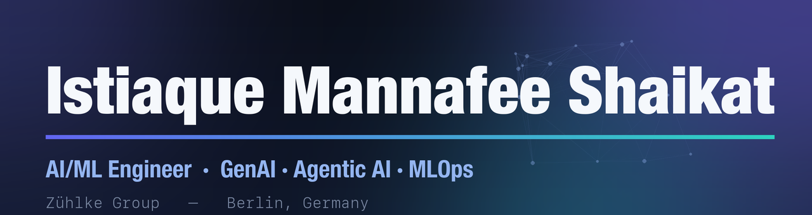

  

**Senior ML Engineer at Zühlke** (currently Expert Machine Learning Engineer), based in Berlin. For 5+ years I've turned generative and agentic AI ideas into production systems for enterprise clients across retail, industrial, and telecom — on AWS and Azure. Three promotions in four years, and a Best Paper Award at ICPRAM 2023.

### What I do

**Generative AI & RAG** — enterprise LLM applications and retrieval systems, from architecture through evaluation. One HR knowledge assistant I built reached **96% retrieval accuracy**.

**Agentic AI** — multi-agent applications wired into enterprise knowledge bases, with the CI/CD, observability, and guardrails needed to run in production.

**MLOps** — cloud-native MLOps and CI/CD foundations that **cut deployment failure rates by over 30%** and **reduced manual release work by ~70%**.

### Selected work

> Enterprise work is under client NDAs, so these are described at a high level — no proprietary detail.

- **Real-time retail behavior analytics** — *Swiss telecom.* On-premise system fusing computer vision, Whisper transcription, camera tracking, and local LLMs (Ollama) to analyze in-store movement, wait times, and staff interaction in real time. `Computer Vision` · `Whisper` · `Ollama`
- **Enterprise HR knowledge assistant (RAG)** — *Swiss automation company.* Full-stack retrieval system over HR policy documents; **96% retrieval accuracy**, multilingual. `Azure OpenAI` · `Azure AI Search` · `FastAPI`
- **Agentic AI over an industrial knowledge base** — *multinational industrial client.* Azure app connecting enterprise knowledge to Python AI agents (OpenAI SDK), with CI/CD and cloud-native deployment. `Azure` · `OpenAI SDK` · `Python`
- **Computer-vision MLOps for recycling** — *Swiss waste-treatment company.* Azure ML pipelines with monitoring and optimization for recycling operations. `Azure ML` · `MLflow`

### Research

- 🏆 **Best Paper Award — ICPRAM 2023.** *Data Streams: Investigating Data Structures for Multivariate Asynchronous Time-Series Prediction.*
- **EEG-based emotion recognition** *(IJECE)* — classifying affective states from EEG via time-frequency analysis. `Signal Processing` · `Scikit-learn` · `TensorFlow`
- **MSc, Data Analytics** — Universität Hildesheim. Time-series prediction, deep learning, and distributed data processing.

### Tools I work with

`Python` · `PyTorch` · `TensorFlow` · `LangChain` · `OpenAI SDK` · `AWS Bedrock` · `Azure OpenAI` · `RAG` · `FastAPI` · `Docker` · `Terraform` · `SageMaker` · `Azure ML` · `MLflow` · `Langfuse` · `CI/CD`

### Let's connect

Happy to talk about production AI, agentic systems, or MLOps — collaboration, a hard problem, or the right role.

[**LinkedIn** → linkedin.com/in/istiaque-shaikat](https://www.linkedin.com/in/istiaque-shaikat/)
